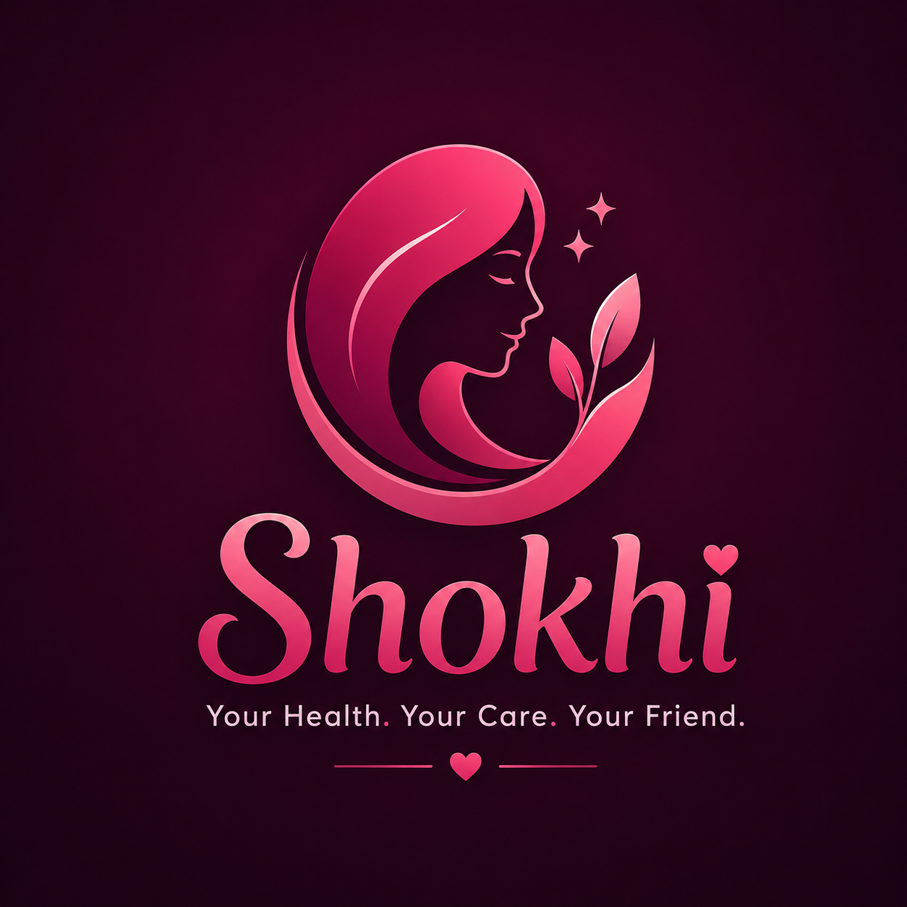

<p align="center">
  
</p>

# 🌸 সখী · Shokhi — A Bangla Women's Health Companion, Powered by Gemma 4

**Shokhi** (সখী — *"a woman's trusted confidante"*) is a warm, Bangla-first health
companion for menstrual health, **PCOS, PMS, and endometriosis** — built for **every**
woman in Bangladesh, from urban teenagers to rural women who may not be able to read.

You describe how you feel — by **typing or speaking in Bangla** — and Shokhi:

1. **Understands** your free-form symptoms (Gemma 4),
2. **Safely triages** them with a deterministic clinical rules layer — *is this an
   emergency, a "see a doctor soon", or safe home care?*,
3. **Explains** kindly, in simple spoken-style Bangla, what it might be and what to do
   (Gemma 4), always pointing you to a real doctor for diagnosis.

> Shokhi is a **health companion, not a doctor**. It gives an initial sense and safe
> guidance; a qualified doctor confirms any diagnosis. Emergencies → **999**.

---

## 🧭 Why Shokhi? The gap in what already exists

The *idea* of digital menstrual health in Bangladesh is not new — but the existing tools
leave the women who need help most **unserved**. Shokhi is a different **implementation**
that targets exactly those gaps.

### Limitations of existing solutions

**Ananya (WaterAid Bangladesh)** — a period **tracker** + cycle prediction + static
informational articles (Android app, Bangla/English):
- ❌ **No AI / no reasoning** — canned, one-size-fits-all content; it can't understand or
  respond to a woman's actual symptom description.
- ❌ **Requires a smartphone + literacy** — you must be able to install an Android app and
  **read** articles. This excludes low-literacy and rural women — the highest-need group.
- ❌ **No clinical triage** — it cannot tell a dangerous red flag from normal cramps.
- ❌ **No PCOS / endometriosis / PMS support** — it is a tracker, not a health advisor.
- ❌ **No voice** — nothing for women who cannot read text.

**Probahini (WaterAid + Acme AI)** — a messenger-based **FAQ chatbot** (Bangla/English):
- ❌ **Scripted, rule-tree conversation** — guided FAQs and myth-busting, but it does not
  *reason* over free-form, messy, real-life symptom descriptions.
- ❌ **Still needs a smartphone, a messaging app, and the ability to read & type.**
- ❌ **No personalized triage** — no "go to hospital now" vs. "safe self-care" decisioning.

**The research is blunt about who gets left out:**
- Rural and less-educated women — who are more likely to be **illiterate** — often have only
  **basic button phones** and **cannot read SMS or app text**; studies find they need
  **voice, in Bangla, ideally via a hotline**.
- **PCOS prevalence in Bangladesh is ~51%**, higher in rural areas, with 50–60% reporting
  depression / anxiety / insomnia — yet **no existing app offers PCOS/endometriosis
  symptom triage**.

### How Shokhi is different (the ownable implementation)

| | Ananya | Probahini | **Shokhi** |
|---|:---:|:---:|:---:|
| Understands free-form Bangla symptoms | ❌ | ⚠️ scripted | ✅ **Gemma 4 reasoning** |
| Clinical red-flag / emergency triage | ❌ | ❌ | ✅ **deterministic safety layer** |
| PCOS / PMS / endometriosis guidance | ❌ | ❌ | ✅ |
| Voice-first (speak & hear Bangla) | ❌ | ❌ | ✅ (+ IVR-hotline roadmap) |
| Serves low-literacy / rural women | ❌ | ❌ | ✅ **designed for them first** |
| Works without installing an app | ❌ | ⚠️ | ✅ web / any browser |
| Adapts across urban teen → rural woman | ❌ | ❌ | ✅ |

*Sources: WaterAid Bangladesh (Ananya / Probahini); Heliyon voice-bot study on marginalized
women's healthcare access; Reproductive Health (BMC) on mobile-phone use among low-income
women; medRxiv 2025 on PCOS prevalence & psychological distress in Bangladesh.*

---

## 🧠 How Gemma 4 is integrated (and why it's core)

Shokhi is built on a **"one Gemma brain, a safety rail underneath"** architecture:

```
  Bangla text / voice
          │
          ▼
  ┌───────────────────┐   free-form language → structured symptoms
  │   Gemma 4         │   (extract_symptoms)
  │   (NLP + empathy) │
  └───────────────────┘
          │  symptom profile (JSON)
          ▼
  ┌───────────────────┐   DETERMINISTIC — never the LLM
  │  Triage engine    │   urgency + red flags + suspected conditions
  │  (triage.ts)      │   (emergency / see-doctor / self-care / info)
  └───────────────────┘
          │  safety-checked result (JSON)
          ▼
  ┌───────────────────┐   result → warm, literacy-appropriate Bangla
  │   Gemma 4         │   (explain_triage, bust_myth)
  │   (generation)    │
  └───────────────────┘
          │
          ▼
  Bangla guidance (text + optional voice)
```

**Gemma 4 does the hard, generative work** — understanding messy real-world Bangla, and
speaking back with warmth at the right literacy level. The **triage decision is made by
rules, not the model**, so Gemma can **never under-triage an emergency** because of a
hallucination. This is the standard safe pattern for health AI: *LLM for language,
deterministic logic for safety-critical decisions.*

The **current web voice path uses the browser's Speech Recognition API** to turn spoken
Bangla into text before sending it through the same Gemma 4 and safety pipeline. This is
available in supported browsers such as Chrome; the backend does not currently claim native
Gemma audio transcription. Supporting (non-generative, allowed) tools: a knowledge base of
red flags / conditions / myths, and the two logistic-regression risk classifiers.

---

## 🚪 One brain, many front doors (reaching *all* women)

| User | Front door | Status |
|---|---|---|
| Urban teen / literate woman | **Web app** (text + voice input) | ✅ this repo |
| Health worker / NGO field staff | Same web app | ✅ this repo |
| **Rural, low-literacy woman** | **IVR voice hotline** — dial, speak Bangla, hear guidance; no smartphone, no reading | 🛣️ roadmap |

Because the triage engine and Gemma backend are fully decoupled from the UI, the *same
core* can power the web app **and** a future phone hotline. The web app already accepts
**spoken Bangla** (browser speech recognition turns it into text, then the identical triage
runs); the planned IVR path can reuse that core behind a Twilio/Exotel phone number with a
separate speech-to-text and text-to-speech adapter, always with a spoken fallback to
**16263 / 999**.

---

## ✨ What Shokhi covers (features)

Beyond symptom triage, Shokhi now spans a woman's whole reproductive life — from her first
period to menopause — as **one warm companion**:

| Area | What it does | Where |
|---|---|---|
| **Bangla ↔ English** | A language toggle across the whole app; curated content is bilingual and Gemma replies in the chosen language | `lib/i18n.ts` |
| **Symptom triage** | Free-form Bangla → urgency + red flags + suspected conditions | `lib/server/triage.ts` |
| **Menstrual cycle tracker** | Log periods privately (on-device); get regularity, next-period estimate, and PCOS/anaemia pattern hints over months | `lib/server/cycle.ts` |
| **Wellness (movement & food)** | Gentle exercise + everyday Bangladeshi food for hormonal balance, **personalised to her cycle phase and conditions** (PCOS/PMS/anaemia/menopause) — body-positive, not diet-culture | `/wellness`, `lib/wellness.ts` |
| **Pregnancy & postpartum** | Danger-sign triage: eclampsia, pre-eclampsia, bleeding, reduced fetal movement, postpartum haemorrhage/sepsis, mastitis, postpartum depression | `knowledge.json` |
| **Menopause / perimenopause** | Recognises hot flashes, night sweats, dryness, mood changes; flags post-menopausal bleeding | `knowledge.json` |
| **Health guides** | Warm, grounded explainers: **contraception, family planning**, menopause care, nutrition/anaemia, first period, menstrual hygiene | `/api/guides` |
| **More conditions** | + UTI, vaginal infection, anaemia, breast-change screening | `knowledge.json` |
| **Myth-busting** | Gentle, shame-free corrections of common beliefs | `/api/myth` |
| **Voice hotline (IVR)** | Dial, speak Bangla, hear guidance — no smartphone, no reading | 🛣️ roadmap |

The **safety model is identical everywhere**: every urgency decision is made by
deterministic rules in `triage.ts`/`cycle.ts`, never by the LLM; Gemma only understands
messy Bangla and speaks back with warmth. New danger signs (e.g. pregnancy `any`-clause
red flags) plug into the same rules table.

---

## 📊 Supporting ML models (PCOS & endometriosis risk)

To strengthen — never replace — Gemma's judgment, Shokhi includes two **lightweight,
non-generative ML classifiers** trained on real public self-report symptom datasets. They
output a **risk probability** that feeds the triage engine as one extra signal. This is
explicitly allowed by the hackathon rules ("traditional ML … that supports and does not
replace Gemma 4 as the primary AI"). **Gemma 4 remains the primary AI** — it does all
language understanding and generates all guidance; the classifier only nudges a suspicion.

| Model | Dataset | Records | Test accuracy | Test AUC |
|---|---|---:|---:|---:|
| PCOS risk | Kaggle *Polycystic Ovary Syndrome (PCOS)* (P. Kottarathil) | 541 | 0.82 | **0.88** |
| Endometriosis risk | *Self-report symptom-based endometriosis prediction* (Scientific Reports, 2023) | 886 | 0.88 | **0.93** |

Key design choice: the models are trained **only on features a woman can self-report in
conversation** (cycle regularity, weight gain, excess hair, acne, period pain, pain during
sex, pelvic pain, infertility) — *not* lab values (FSH/LH/AMH/ultrasound) that a chat
can't provide — so the same symptoms Gemma extracts drive the prediction. The risk signal
**never overrides** the deterministic urgency; an emergency stays an emergency.

The classifiers are **logistic regression**, trained offline and **exported to plain JSON
coefficients** (`lib/server/risk-models.json`) so inference runs in pure TypeScript at
request time — **no Python, no ML runtime** on the server. Retrain any time:

```bash
python3 ml/train_export.py     # retrains from ml/datasets/ and rewrites the JSON
```

The layer is **fully optional**: if the JSON is absent the signal simply turns off and the
app runs unchanged. *Dataset licenses: verify on source before redistribution; used here
for research/education.*

## 🔎 RAG — grounded, cited answers (in simple words)

**The problem it solves.** Without RAG, Shokhi could only answer from the notes we wrote
by hand. If a question fell outside those notes, the model might answer from its own memory
— which can be wrong, and can't point to a source.

**What RAG does.** RAG stands for **Retrieval-Augmented Generation**. In plain words: before
Shokhi answers, it first **looks the topic up in a small library of trusted health
documents** (WHO, national health guidelines), pulls out the few most relevant paragraphs,
and hands them to **Gemma** saying *"answer using only this."* Gemma then writes a warm,
simple Bangla answer **and shows which source it came from**.

> Like a friend who quickly checks a trusted book before speaking — instead of guessing
> from memory. More accurate, wider coverage, and every answer is traceable.

**How it works here (three steps):**

1. **Retrieve** — the question is turned into a list of numbers (an *embedding*) with
   Google `gemini-embedding-001`, and compared (cosine similarity) against the pre-embedded
   passages in `lib/server/rag/corpus.json`. The closest few win.
2. **Augment** — those passages become the *context* inside the prompt.
3. **Generate** — **Gemma 4** writes the final answer from that context, and the app appends
   a **📚 Sources** line with links.

It's wired into the **topic / guide explanations** (the Guides page and the chat's
"learn about a topic" chips). If nothing relevant is retrieved, it **falls back** to the
hand-written knowledge base. **Urgency is still decided by rules** (`triage.ts`), never by
retrieval — so RAG makes the *information* richer without ever affecting safety.

**Is this "really" RAG even though it's TypeScript, not Python?** Yes. RAG is an
*architecture* (retrieve → augment → generate), not a Python library. Every part has a
TypeScript equivalent, so the whole pipeline runs in this one Next.js app — **no Python, no
separate service.**

**Rules compliance.** Embeddings and vector search are **non-generative** techniques, which
the hackathon rules explicitly permit as *support*. **Gemma 4 remains the only LLM that
generates answers** — no other language model is used anywhere.

**Build / update the corpus** (100% TypeScript):

```bash
npm run ingest     # reads lib/server/rag/sources/*.md → chunks → embeds → corpus.json
```

With `GOOGLE_API_KEY` set it embeds with `gemini-embedding-001`; with no key it uses a small
offline embedder so a fresh clone still works.

### 📚 Data sources in the RAG corpus (references for judging)

The retrieval corpus (`lib/server/rag/sources/`) is built **only from public, official,
appropriately-licensed health sources**, each stored in-repo with its title, URL and licence
in the file's frontmatter. Current documents:

| Topic | Source | Link | Licence |
|---|---|---|---|
| Menstrual health | WHO — Menstrual health (fact sheet) | https://www.who.int/news-room/fact-sheets/detail/menstrual-health | CC BY-NC-SA 3.0 IGO |
| PCOS | WHO — Polycystic ovary syndrome (fact sheet) | https://www.who.int/news-room/fact-sheets/detail/polycystic-ovary-syndrome | CC BY-NC-SA 3.0 IGO |
| Endometriosis | WHO — Endometriosis (fact sheet) | https://www.who.int/news-room/fact-sheets/detail/endometriosis | CC BY-NC-SA 3.0 IGO |
| Menopause | NHS — Menopause and perimenopause | https://www.nhs.uk/conditions/menopause/ | Crown / NHS, OGL v3.0 |
| Contraceptive safety | WHO — Medical eligibility criteria for contraceptive use, 6th ed. (2025) | https://www.who.int/publications/b/81082 | CC BY-NC-SA 3.0 IGO |
| Postpregnancy family planning | WHO — Scaling up postpregnancy family planning: practical guide (2025) | https://www.who.int/publications/i/item/9789240111073 | CC BY-NC-SA 3.0 IGO |
| HIV services | WHO — Consolidated HIV guidelines: service delivery (2026) | https://www.who.int/publications/i/item/9789240124233 | CC BY-NC-SA 3.0 IGO |
| Antenatal care (Bangladesh) | DGHS/DGFP national ANC schedule + WHO ANC recommendations | https://old.dghs.gov.bd/index.php/en/publications | Govt of Bangladesh (public) + WHO CC BY-NC-SA 3.0 IGO |
| Family planning (Bangladesh) | DGFP — Directorate General of Family Planning | https://dgfp.gov.bd | Govt of Bangladesh (public) |
| Menstrual regulation & post-abortion care (Bangladesh) | DGFP / DGHS | https://dgfp.gov.bd | Govt of Bangladesh (public) |
| Maternal & newborn health (Bangladesh) | icddr,b — Maternal & neonatal health research | https://www.icddrb.org/research/research-themes/maternal-and-neonatal-health/impact | © icddr,b (cited) |

**Authoritative source hubs** used / recommended for expanding the corpus:

- **WHO** — [fact sheets](https://www.who.int/news-room/fact-sheets) · [publications](https://www.who.int/publications) · [sexual & reproductive health](https://www.who.int/health-topics/sexual-and-reproductive-health-and-rights)
- **Bangladesh DGHS / MOHFW / DGFP** — [DGHS publications](https://old.dghs.gov.bd/index.php/en/publications) · [DGHS guidelines](https://old.dghs.gov.bd/index.php/en/mis-docs/important-documents/category/গাইডলাইন) · [MOHFW](https://mohfw.gov.bd) · [DGFP archive](http://archive.dgfp.gov.bd)
- **icddr,b** — [maternal & neonatal health research](https://www.icddrb.org/research/research-themes/maternal-and-neonatal-health)
- **NHS / NHS inform / HSE** — [NHS Women's health](https://www.nhs.uk/womens-health/) · [NHS conditions A–Z](https://www.nhs.uk/conditions/) · [NHS inform women's health](https://www.nhsinform.scot/healthy-living/womens-health/) · [HSE women's health A–Z](https://www2.hse.ie/conditions/womens-health-a-z/)

#### Attribution & licences (courtesy)

**Code licence:** the source code is released under the **[MIT License](LICENSE)** ©
2026 Ahiraf. The MIT licence covers the *code only* — the bundled health content keeps
its publishers' licences (see below and `LICENSE` for the code-vs-content scope).

Full source credits and licence details are in **[ATTRIBUTION.md](ATTRIBUTION.md)**. In short:

- **WHO** content is reused under **CC BY-NC-SA 3.0 IGO** (attribution, non-commercial,
  share-alike). Shokhi's summaries are **adaptations**, carrying WHO's required disclaimer:
  > *This is an adaptation of an original work by WHO. This adaptation was not created by WHO.
  > WHO is not responsible for the content or accuracy of this adaptation.*
- **NHS** content is reused under the **Open Government Licence v3.0**:
  > *Contains information from NHS England, licensed under the current version of the Open
  > Government Licence.*
- **Bangladesh DGHS/DGFP** and **icddr,b** material is **summarised with attribution** for
  educational, non-commercial use.

Shokhi is **free and non-commercial**; no source endorses it and no logos are used. Every
RAG answer is summarised for a low-literacy audience and **cites its source**; it is general
information, not a diagnosis. Add documents by dropping a `.md` (with `title/source/url/
license` frontmatter) into `lib/server/rag/sources/` and re-running `npm run ingest`.

## 🚀 Quick start

Shokhi is a **single Next.js app** at the repo root: the UI and the backend live together
as API routes (`app/api/*`), so there's one thing to run and one thing to deploy.

```bash
npm install
cp .env.local.example .env.local     # add your GOOGLE_API_KEY (or leave blank for the mock)
npm run dev                          # open http://localhost:3001
```

- **Without a key** the app runs on a **deterministic mock backend** — the full flow works
  offline, just with keyword-based (not real Gemma) understanding.
- **For live Gemma 4**, put a Google AI Studio key in `.env.local` as `GOOGLE_API_KEY`
  (optionally `GOOGLE_API_KEY_2`/`_3` for quota fallback). The server auto-selects Gemma.

Run the **safety tests** (Vitest — verifies emergencies are never downgraded, the ML signal
never overrides urgency, and RAG degrades gracefully):
```bash
npm test                       # 9 tests, no key/network needed
```

The two risk classifiers are retrained/exported offline (Python, not needed to run the app):
```bash
python3 ml/train_export.py     # → lib/server/risk-models.json
```

---

## 🗂️ Project structure

The Next.js app lives at the **repo root** (deploys to Vercel with no root-directory config):

```
Shokhi/
├── app/
│   ├── (pages)            # landing, chat, tracker, guides, learn, myths, wellness,
│   │                      #   hotline, about, profile — one route per feature, bilingual
│   └── api/               # the backend, as Next.js route handlers:
│                          #   message, myth, guide, guides/[id], knowledge,
│                          #   cycle/analyze, health
├── components/            # Nav, Message, Composer, CycleTracker, Mascot3D, PageIntro …
├── lib/
│   ├── api.ts, i18n.ts    # client-side API calls + Bangla/English strings
│   └── server/            # the backend (server-only):
│                          #   triage.ts (deterministic safety engine, no LLM),
│                          #   cycle.ts, assistant.ts, gemma.ts (mock + Gemma via
│                          #   @google/genai), prompts.ts, risk.ts,
│                          #   knowledge.json, risk-models.json
├── public/                # logo, favicons, 3D-mascot poses
├── ml/                    # OFFLINE only (not deployed)
│   └── train_export.py    # retrains the LR classifiers → lib/server/risk-models.json
├── docs/                  # writeup, platform decision PDF
└── README.md
```

## 🌐 Deploy (one click, Vercel)

Because the backend is part of the Next.js app, there's **one deployment** — always-on,
no separate server, no CORS, no cold-start "sleep" to work around:

1. Import the repo at [vercel.com/new](https://vercel.com/new) (the app is at the repo root —
   no root-directory setting needed).
2. Add environment variables (server-side): `GOOGLE_API_KEY` (+ optional `GOOGLE_API_KEY_2`/`_3`).
3. Deploy → public link. That's it.

## ⚙️ Configuration

All server-side (set in `.env.local` locally, or Vercel env vars in prod):

| Env var | Default | Meaning |
|---|---|---|
| `GOOGLE_API_KEY` | — | Google AI Studio key for live Gemma 4. Absent → deterministic mock backend. |
| `GOOGLE_API_KEY_2`, `_3` | — | Optional extra keys (other Google accounts) for automatic quota fallback. |
| `SHOKHI_GEMMA_MODEL` | `gemma-4-26b-a4b-it` | Gemma 4 model on AI Studio (e.g. `gemma-4-31b-it`). |
| `SHOKHI_BACKEND` | auto | Force `gemini` or `mock`. Default: `gemini` if a key is present, else `mock`. |
| `SHOKHI_LLM_EXTRACT` | off | Optional Gemma symptom extraction; leave off for the faster deterministic intake path. |
| `SHOKHI_SAFETY_NET` | off | Optional second Gemma emergency check; deterministic safety triage always remains enabled. |

## 🔮 Future plans

### Offline, edge deployment for no-internet rural clinics

The Gemma backend sits behind **one swappable interface** (`lib/server/gemma.ts` —
today `mock` and hosted `gemini`). A **local Gemma 4** backend (e.g. via Ollama) can drop
into that same interface with zero changes to the rest of the app — which unlocks a future
the existing apps cannot reach:

- **Hosted (API key) — reach the whole country over the internet.** The cloud runs Gemma 4;
  any woman opens the web link from any browser. *This is the near-term product.*
- **Local (roadmap) — genuinely offline, for places with no internet.** A single device
  (laptop / mini-PC / kiosk) at a **rural health center or Union Parishad office** runs
  Gemma 4 on-device, serving whoever is physically there — no internet, no data cost, no
  cloud. Same codebase, just a different backend behind the interface.

### Other planned work
- **Bangla voice hotline (IVR):** the top priority for reaching phone-only, low-literacy
  women — dial a number, speak Bangla, hear guidance. Same backend, phone front door.
- **IVR speech adapter:** add a verified speech-to-text and text-to-speech service for phone audio.
- **Grounded knowledge expansion** validated against public research/clinical datasets.
- **NGO pilot** to measure real referral and awareness outcomes.

## ⚠️ Safety & scope

Shokhi does **not** diagnose or prescribe. It surfaces conditions as *"worth discussing
with a doctor,"* always shows the free government health hotline (**16263**) and emergency
number (**999**), and routes red flags to urgent care. It is an awareness and access tool,
not a replacement for medical care.

---

*Built for the Build with Gemma 4 Community Hackathon. Gemma 4 is the only LLM used.*
